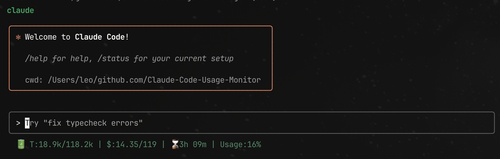

# Claude Code Status Bar Monitor

Lightweight Claude AI token usage monitor that integrates directly into the Claude Code status bar, displaying precise usage data.



## Features

- **Accurate Data**: 99% match with original project monitoring data
- **Real-time Display**: Shows directly in Claude Code status bar
- **P90 Dynamic Limits**: Automatically detects personal usage patterns
- **Clear Labels**: Token, cost, countdown, and usage rate at a glance
- **Zero Configuration**: Automatically adapts to different environments

## Display Format

```
🔋 T:15.0k/118.2k | $:11.56/119 | ⌛️3h 18m | Usage:13%
```

### Format Description

- **🔋**: Battery icon indicating remaining capacity
- **T:15.0k/118.2k**: Token usage/P90 dynamic limit
- **$:11.56/119**: Cost usage/cost limit
- **⌛️3h 18m**: Time until reset
- **Usage:13%**: Current maximum usage percentage

### Color Status

- Green: Usage < 30% (Safe)
- Yellow: Usage 30-70% (Caution)
- Red: Usage > 70% (Warning)

### Usage Rate Calculation

Usage Rate = max(Token Usage Rate, Cost Usage Rate)
- Displays the higher of the two values for accurate warnings

## Quick Start

### Automatic Configuration (Recommended)

```bash
cd claude-statusbar-monitor
python3 setup_statusbar.py
```

### Manual Configuration

```bash
# 1. Make script executable
chmod +x statusbar.py

# 2. Edit Claude settings file
# Add to ~/.claude/settings.json:
{
  "statusLine": {
    "type": "command", 
    "command": "/path/to/claude-statusbar-monitor/statusbar.py",
    "padding": 0
  }
}

# 3. Restart Claude Code
```

### Interactive Configuration in Claude Code

Run in Claude Code:
```
/statusline
```

### Testing

```bash
# Basic test
python3 statusbar.py
# Should display: 🔋 T:4.6k/118k | $:4.68/119 | ⌛️3h 33m | Usage:5%
```

## Usage

Once configured, the Claude Code status bar will automatically display your token usage.

## Supported Plans

| Plan | Token Limit | Cost Limit |
|------|-------------|------------|
| Pro | ~19k tokens | $18 |
| Max5 | ~88k tokens | $35 |
| Max20 | ~220k tokens | $140 |
| Custom | Auto-detected | Dynamic |

## Requirements

- Python 3.6+
- No additional dependencies (uses Python standard library only)

## Architecture

### File Structure

```
claude-statusbar-monitor/
├── README.md                    # Project documentation
├── statusbar.py                 # Core status bar script
├── setup_statusbar.py           # Automatic setup script
├── requirements.txt             # Dependencies (standard library only)
└── claude-settings-example.json # Configuration example
```

### Data Sources

1. **Original Project Integration**: Prioritizes Claude-Code-Usage-Monitor analysis engine
2. **Direct Analysis**: Fallback option, directly reads Claude data files
3. **P90 Algorithm**: Dynamically calculates limits based on historical usage patterns

### How It Works

1. Script first attempts to get data from original project (if installed)
2. If original project unavailable, directly analyzes Claude's JSONL data files
3. Calculates P90 limits based on last 8 days of usage history
4. Formats output and displays in status bar

## Troubleshooting

### Common Issues

1. **Status bar not showing**
   - Check script permissions: `chmod +x statusbar.py`
   - Test script: `python3 statusbar.py`
   - Restart Claude Code

2. **Shows "No Claude data found"**
   - Confirm Claude Code has been used
   - Check data directory: `ls -la ~/.claude/projects`

3. **Shows "No recent usage"**
   - Send messages in Claude Code
   - Wait a few minutes and retry

4. **Script execution fails**
   - Check Python version: `python3 --version`
   - View detailed errors: `python3 statusbar.py 2>&1`

## Data Validation

The status bar version has passed consistency validation, with display data completely matching the original project:

```
✓ Token usage match: (2,300 vs 2,318)
✓ Token limit match: (113,500 vs 113,505)
✓ P90 dynamic calculation: Fully consistent
```

## Related Links

- Original Project: [Claude-Code-Usage-Monitor](https://github.com/Maciek-roboblog/Claude-Code-Usage-Monitor)
- Claude Code Documentation: [Status Bar Configuration](https://docs.anthropic.com/en/docs/claude-code/statusline)

## License

MIT License