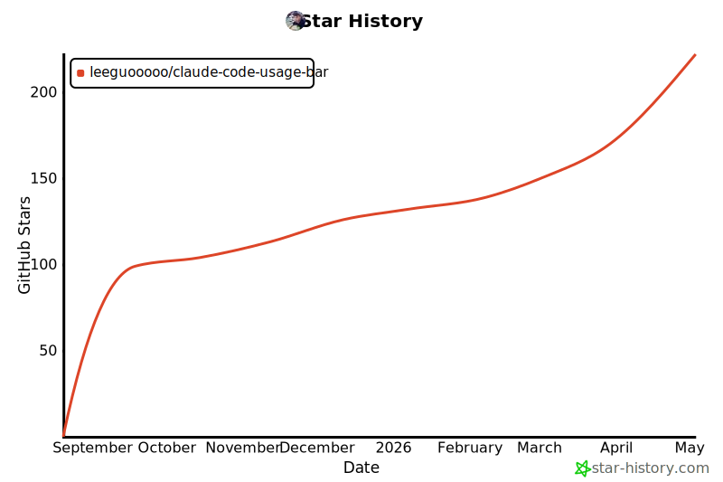

<div align="center">

# Claude Status Bar

**Your Claude Code usage, at a glance.**
5h / 7d rate-limit bars, reset countdowns, model, context window, and prompt-cache
freshness — inline in Claude Code's status line, or a floating HUD on the desktop app.

[](https://pypi.org/project/claude-statusbar/)
[](https://pepy.tech/project/claude-statusbar)
[](https://pypi.org/project/claude-statusbar/)
[](https://github.com/leeguooooo/claude-code-usage-bar/actions/workflows/ci.yml)
[](LICENSE)
[](https://github.com/leeguooooo/claude-code-usage-bar/stargazers)

**English** · [简体中文](README.zh-CN.md) · [Install](docs/install.md) · [Documentation](#-documentation)


</div>

```
5h[   27%    ]⏰1h28m →42% | 7d[   79%    ]⏰11h28m →88% | Opus 4.8(350.0k/1.0M) | cache 4m23s
```

Claude Code tells you almost nothing about where you stand against your rate limits.
`claude-statusbar` puts the numbers that matter on one quiet line at the bottom of your
terminal — so you never switch context to a separate window to answer *"how much have I
got left, and when does it reset?"*

---

## ✨ Features

- 📊 **Official 5h / 7d usage** — the same rate-limit numbers Claude Code enforces, with reset countdowns and end-of-window projections (`→NN%`), not a local guess.
- 🧠 **Model & context window** — current model and how full the context is (`Opus 4.8 · 350k/1M`).
- ⏱ **Prompt-cache countdown** — see how long your cache stays warm (`cache 4m23s`) so you know when the next turn pays full price.
- 💰 **Cost & balance** — optional per-session cost, or live relay/API balance in no-quota setups.
- 🖥 **Two surfaces** — inline `statusLine` in the terminal, **or** an always-on-top floating HUD for the Claude desktop app (macOS).
- 🎨 **3 styles × 9 themes** — switch the whole look with one command; battery-bar, capsule, or hairline.
- ⚡ **Fast by design** — an optional daemon renders in well under 1% CPU even at a 1-second refresh.
- 🔌 **More when you want it** — git branch & diff stats, session activity, AgentParty/Codex presence, IELTS writing-coach progress — each opt-in.
- 📦 **Zero-dependency install** — a single prebuilt binary (no Python needed) or a `pip` package. Auto-updates.

## 🚀 Install

### Claude Code (terminal)

**One line — no Python, no pip.** Downloads a prebuilt standalone binary for your platform
(macOS arm64/x86_64, Linux x86_64) and wires up the status line:

```bash
curl -fsSL https://raw.githubusercontent.com/leeguooooo/claude-code-usage-bar/main/install.sh | bash
```

<sub>Security-conscious? Download and read it first — the header lists exactly what it touches.
On platforms without a prebuilt binary it falls back to pip.</sub>

Prefer pip / uv, or want the desktop HUD extra? Install the Python package:

```bash
pip install claude-statusbar     # or: uv tool install / pipx install
cs --setup                       # wires the statusLine hook + installs the skill
```

Restart Claude Code and the bar appears at the bottom. Other paths (skill-only, plugin
marketplace, Codex/AgentParty bridge) are in the **[install guide](docs/install.md)**.

> 📖 **Deep dive:** [Is that `cache 4m23s` line actually accurate? — how the prompt-cache countdown is computed](https://blog.leeguoo.com/en/posts/claude-statusbar-cache-countdown/)

### Claude desktop app (macOS) — `cs hud`

The desktop app has no status line, so `cs hud` adds an always-on-top floating panel with the
same **official** 5h / 7d usage (sampled by the desktop app itself, not an estimate) and your
active AgentParty channels.

```bash
pip install 'claude-statusbar[hud]'   # adds PyObjC (macOS GUI deps)
cs hud install                        # launchd: auto-start on login + keep-alive
```

<div align="center">


</div>

Collapsed pill → click to expand → drag anywhere; it hides when the desktop app isn't open.
Full details in the **[Desktop HUD guide](docs/desktop-hud.md)**.

## 👀 What it shows

```
5h[   27%    ]⏰1h28m →42% | 7d[   79%    ]⏰11h28m →88% | Opus 4.8(350.0k/1.0M) | cache 4m23s | $ 1.42
⤷ claude-code-usage-bar ⎇ main● · +182 -47 · ⏱ 12m · v3.12.0
⚙ effort:high · think:on · fast:off · style:default
```

| Line | Contents |
|---|---|
| **1** | 5h / 7d rate-limit usage + reset timers + end-of-window projections, model & context window, prompt-cache countdown, optional session cost / relay balance |
| **2** | project + git branch, session `+/−` lines, duration, version |
| **3** | session mode (effort / thinking / fast / style) |

Plus optional **activity** and **AgentParty** lines. The full per-segment breakdown — every
icon, color threshold, and toggle — is in the **[segment reference](docs/segments.md)**.

## 📚 Documentation

| Guide | What's inside |
|-------|---------------|
| [Install](docs/install.md) | Binary, PyPI, one-shot installer, skill-only, plugin, Codex bridge |
| [What it shows](docs/segments.md) | Full per-segment reference table |
| [Styles & themes](docs/styles-and-themes.md) | 3 styles × 9 themes, previews, slash commands |
| [Configuration](docs/configuration.md) | Config file, all `show_*` keys, env vars, JSON output, CLI cheatsheet |
| [Desktop HUD (`cs hud`)](docs/desktop-hud.md) | macOS floating panel for the Claude desktop app |
| [Fast mode (daemon)](docs/daemon.md) | Sub-1% CPU daemon, launchd / systemd auto-start |
| [No-quota mode](docs/no-quota-mode.md) | Relay / Bedrock / Vertex layout, context battery, balance |
| [AgentParty / Codex bridge](docs/agentparty.md) | Local workspace-presence line |
| [Cache countdown](docs/cache-countdown.md) | Data source + how `cache 4m23s` is computed |
| [Troubleshooting](docs/troubleshooting.md) | `cs doctor`, common problems, upgrading |

## 🆚 Comparison

There are a few good Claude Code usage monitors. They solve overlapping but distinct
problems — pick the one that matches *where* you want the information.

| Tool | Lives in | Optimized for |
|---|---|---|
| **claude-statusbar (`cs`)** | Claude Code's `statusLine` (one line at the bottom) | Glanceable while you work; zero context-switching |
| [ccusage](https://github.com/ryoppippi/ccusage) | Standalone TUI in a separate terminal window | Long-form usage analytics, cost breakdowns over weeks |
| [Claude Code Usage Monitor](https://github.com/Maciek-roboblog/Claude-Code-Usage-Monitor) | Standalone TUI with predictive burn-rate | Real-time burn-rate forecast for paid plans |

`cs` is intentionally one line of color and one decision per second. If you want a dashboard
with charts, daily/weekly aggregates, and burn-rate prediction, run a TUI in a side pane. The
two coexist nicely.

## 🔌 Integrations

**[prompt-language-coach](https://github.com/leeguooooo/prompt-language-coach)** — install the
plugin to track IELTS band progress. The bar then shows your writing level and trend
automatically (no config; appears when `~/.claude/language-progress.json` exists):

```
... | Opus 4.8(350k/1M) | 📚 EN:6.0↑ JA:5.0→
```

`↑` improved · `↓` dropped · `→` no change since last session.

## 🤝 Contributing

PRs welcome. The full contributor guide — local setup, test commands, architecture map, coding
conventions, release flow — is in **[CONTRIBUTING.md](CONTRIBUTING.md)**. Security issues:
**[SECURITY.md](SECURITY.md)**.

```bash
git clone https://github.com/leeguooooo/claude-code-usage-bar
cd claude-code-usage-bar
uv sync
PYTHONPATH=src uv run pytest tests/   # 900+ tests, ~3s
```

The render path is hot (up to 60×/min at `refreshInterval: 1`) — `tests/test_import_perf.py`
pins which modules can't be imported on the fast path. Read CONTRIBUTING.md before adding
dependencies.

📋 Every version's changes: **[CHANGELOG.md](CHANGELOG.md)** · [GitHub Releases](https://github.com/leeguooooo/claude-code-usage-bar/releases).

## 🙏 Acknowledgments

- [@marcwimmer](https://github.com/marcwimmer) — original `show_cache_age` widget ([#9](https://github.com/leeguooooo/claude-code-usage-bar/pull/9))
- [claude-monitor](https://github.com/Maciek-roboblog/Claude-Code-Usage-Monitor) — token-usage analysis library used as the optional fast-path data source

<a href="https://github.com/leeguooooo/claude-code-usage-bar/graphs/contributors">
  
</a>

## Star history

<a href="https://star-history.com/#leeguooooo/claude-code-usage-bar&Date">
  <picture>
    <source media="(prefers-color-scheme: dark)" srcset="docs/images/star-history-dark.svg">
    
  </picture>
</a>

<sub>Static snapshot taken at v3.3.x; <a href="https://star-history.com/#leeguooooo/claude-code-usage-bar&Date">click for the live chart</a>.</sub>

---

<div align="center">
<sub>MIT © <a href="https://github.com/leeguooooo">leeguooooo</a> · Built for people who live in Claude Code.</sub>
</div>
