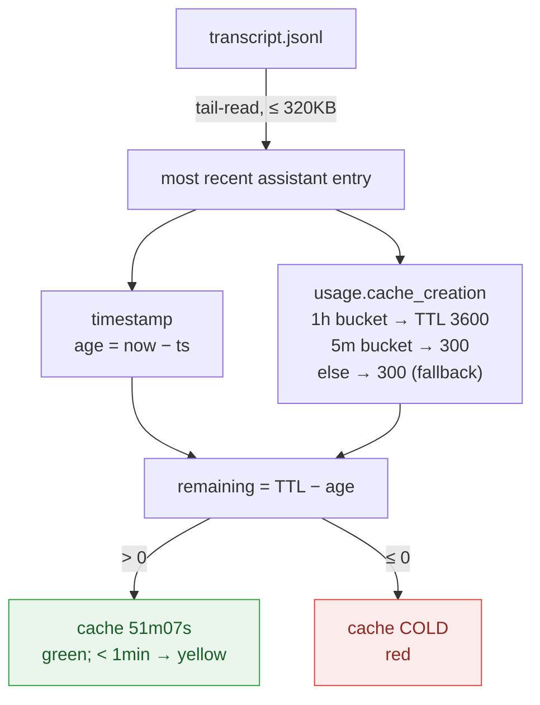

# Claude Status Bar

[](https://pypi.org/project/claude-statusbar/)
[](https://pypi.org/project/claude-statusbar/)
[](https://pepy.tech/project/claude-statusbar)
[](LICENSE)
[](https://github.com/leeguooooo/claude-code-usage-bar/stargazers)

Lightweight status-line monitor for Claude Code, with a local AgentParty bridge
for Codex workflows. In Claude Code it shows your 5h / 7d rate-limit usage,
reset timers, current model, context window, prompt-cache freshness, and
(optionally) session cost. In Codex + AgentParty workflows it can append the
current AgentParty channel, identity, listener, unread count, and last-message
preview from a local cache.

```
5h[   27%    ]⏰1h28m →42% | 7d[   79%    ]⏰11h28m →88% | Opus 4.8(350.0k/1.0M) | cache 4m23s
```

> 📖 **Deep dive:** [Is that `cache 4m23s` line actually accurate? — how the prompt-cache countdown is computed](https://blog.leeguoo.com/en/posts/claude-statusbar-cache-countdown/)


3 styles × 9 themes, configurable in one command. Auto-updates from PyPI. For
Claude Code, run `pip install claude-statusbar && cs --setup` and restart
Claude Code.

## Contents
- [Latest release](#latest-release)
- [What it shows](#what-it-shows)
- [Claude Code vs Codex support](#claude-code-vs-codex-support)
- [Install](#install)
- [Styles & themes](#styles--themes)
- [Configuration](#configuration-file)
- [Fast mode (daemon)](#fast-mode--for-refreshinterval-1)
- [Slash commands](#slash-commands-inside-claude-code)
- [`cs doctor` — self-diagnostic](#cs-doctor--self-diagnostic)
- [Usage cheatsheet](#usage)
- [Environment variables](#environment-variables)
- [How the cache countdown works](#how-the-cache-countdown-works)
- [Troubleshooting](#troubleshooting)
- [Upgrading](#upgrading)
- [Comparison with alternatives](#comparison-with-alternatives)
- [Integrations](#integrations)
- [Contributing](#contributing)
- [Acknowledgments](#acknowledgments)
- [Contributors](#contributors)

## Latest release

**v3.29.12** (2026-07-15) — **AgentParty status is session-correct end to end**: sessions sharing one project now read channel, identity, unread count, message preview, and listener state from their own config-owned cache slot instead of mixing those fields with the workspace's last writer.

**v3.29.11** (2026-07-11) — **AgentParty identity is session-correct**: two Claude Code sessions in the same project can use different `AGENTPARTY_CONFIG` files without both status bars collapsing to the last writer's agent name. Only config paths from actual shell tool calls count; paths quoted in chat do not override identity.

**v3.29.6** (2026-07-10) — **support docs cleanup**: the README now states the support boundary explicitly. Claude Code is the full native `statusLine` integration; Codex support is the AgentParty local status bridge and does not include OpenAI quota/session accounting.

**v3.29.5** (2026-07-09) — **service daemon and AgentParty session fixes**: `cs daemon stop` and upgrade drift-kill now recognize launchd/systemd-managed daemons, pidfile cleanup no longer deletes a newer daemon owner's pidfile, and the AgentParty block is gated on session transcript evidence so unrelated windows in the same repo do not inherit another agent's channel line.

**v3.29.0** (2026-07-09) — **AgentParty block redesign + daemon-restart fixes.** The AgentParty line was unreadable (`FAINT` stacked on the dimmest grey) and always claimed `watch down`: the reader looked for `heartbeat_at` while the contract writes `heartbeat_ts`, so every live listener read as dead. Now it renders as two lines with monochrome glyphs that inherit the theme — a header that states the listening state outright, and the last message on its own line marked `●` unread / `○` read and `@` when it mentions you. Also fixes three daemon defects found while chasing "I upgraded but nothing changed": the code-drift tick burned its own 30s spawn debounce and left every session inline-rendering; `_signal_outdated_daemon` could SIGTERM a recycled PID belonging to an unrelated process; and the orphan-`.tmp` sweep + auto-update check were starved by sharing a timer seeded to daemon start (a daemon that restarts on drift never lived the 30 minutes needed to fire either).

**v3.28.2** (2026-07-09) — **uv-tool upgrade fix**: `cs upgrade` now detects uv-tool Python symlinks correctly and selects `uv tool install --upgrade claude-statusbar`.

**v3.28.1** (2026-07-09) — **upgrade/version UX fix**: `cs upgrade` upgrades the install channel that is actually running `cs` (`uv tool`, `pipx`, or plain `pip`), and `cs -v`, `cs -V`, `cs -version` all work like `cs --version`.

**v3.28.0** (2026-07-09) — **AgentParty / Codex bridge line** (`show_party`, default on): when the same workspace has AgentParty local status, `cs` appends `🎈 #channel · 🤖/👤 name · 👂watch/serve · unread · last message` under the project line. This is local-only (`~/.agentparty/state/<workspaceId>/statusline.json`), uses the same cwd-scoped workspace id fixtures as AgentParty, and marks stale/down listener state instead of pretending it is live.

**v3.27.0** (2026-07-03) — **IP-risk detection aligned with ip-check**: China-cloud provider detection and ban-risk threshold handling now match the ip-check.leeguoo.com classifier.

**v3.11.0** (2026-06-02) — **rate-limit projections** (`show_projection`, default on): after each `⏰<reset>` timer the bar shows `→NN%`, your expected end-of-window usage. The 5h model blends recent pace, whole-window average, and a local baseline; the 7d model integrates learned coarse rhythm buckets (work hours, non-work hours, night, weekend) so a busy first day is not blindly extrapolated across the whole week. `show_forecast` remains the separate `⚠<eta>` warning chip for imminent cap hits. Plus: `context_window.used_percentage = null` handled gracefully, and the daemon only renders windows active in the last 10s.

**v3.10.0** (2026-06-02) — **live-activity line** (in-progress todo, active tool, completed-tool rollup), **git ahead/behind + session duration/lines** on the project line, **running-subagent** lines, an opt-in **`bar_shimmer`** starfield on the battery bars, and a **self-hosted plugin marketplace**. Plus: auto-update now actually runs in daemon mode (detached, non-blocking), and the cache countdown is per-session-correct. All new segments are opt-in except the todo line.

**v3.6.0** (2026-05-08) — **`cs --setup` now defaults to daemon (fast) mode**: under 1% CPU continuously instead of ~3% inline. Pass `--inline` to opt back. Also: py3.9 compat fixes, GitHub Actions CI, animated hero GIF.

**v3.5.1** — `npx skills add` install path, `show_cache_age` on by default.

**v3.5.0** — consolidated `claude-statusbar` skill: say *"switch theme to nord"* / *"余量颜色改成 #4ec85b"* and Claude Code routes it to the right `cs` command.

**v3.4** — per-segment color management (each metric colors itself by its own severity), classic style finally respects themes, two new themes (`catppuccin-mocha`, `tokyo-night`), per-severity color overrides via `cs config set color_ok|warn|hot`.

**v3.2** — daemon fast-mode (now the default in v3.6.0) for ~5× lower CPU at `refreshInterval=1`.

📋 **Full changelog:** [CHANGELOG.md](CHANGELOG.md) · [GitHub Releases](https://github.com/leeguooooo/claude-code-usage-bar/releases) — every version's changes, also linked from the [PyPI page](https://pypi.org/project/claude-statusbar/).

## What it shows

```
5h[   27%    ]⏰1h28m →42% | 7d[   79%    ]⏰11h28m →88% | Opus 4.8(350.0k/1.0M) | cache 4m23s | $ 1.42
⤷ claude-code-usage-bar ⎇ main● · +182 -47 · ⏱ 12m · v3.12.0
⚙ effort:high · think:on · fast:off · style:default
```

| Segment | Meaning |
|---------|---------|
| `5h[27%]` | 5-hour rate-limit usage (rolling window from Anthropic API headers) |
| `⟳ 5h/7d stale·restart` | Shown (in place of the two bars) when the cached 5h/7d data has gone stale because cs stopped receiving fresh ticks — usually another tool displaced the statusLine, or the daemon died. Restart Claude Code to refresh; if it keeps happening, run `cs --setup` to reclaim the statusLine. `cs doctor` explains it in detail. |
| `⏰1h28m` | Time until the 5-hour window resets |
| `7d[79%]` | 7-day rate-limit usage |
| `⏰11h28m` | Time until the 7-day window resets |
| `→42%` / `→88%` | Projected end-of-window usage at your current rhythm (`show_projection`, on by default). Muted < 80%, yellow ≥ 80%, red ≥ 100%. The 5h model blends recent pace + whole-window average + a local baseline; the 7d model integrates learned day/night/weekend buckets so a busy first day isn't extrapolated across the week. |
| `⚠~18m` | At-risk warning chip — only when a window is projected to hit 100% **and** the cap is imminent (≤ 1 h). Separate from the projection (`show_forecast`, on by default). |
| `Opus 4.8(350.0k/1.0M)` | Model name + current context window usage |
| `cache 4m23s` / `cache COLD` | Countdown to prompt-cache expiry — the TTL (5min vs 1h) is auto-detected from the transcript, so it's right on a subscription (1h) or an API key (5min). Green when comfortable, yellow under 1min, red on COLD. Cache hits consume ~10× less rate-limit quota — for subscribers, letting it go COLD eats your 5h / 7d windows ~10× faster. Enabled by default; disable with `cs config set show_cache_age false` |
| `$ 1.42` | Session cost in USD as Claude Code reports it. For Pro/Max subscribers this is the **API-equivalent value** of your usage (i.e. what it would cost on the API), not money owed. Useful as an ROI signal. Opt-in: `cs config set show_cost true` |
| `bal[████ 52%] $26.00` | **Relay account balance** — only in no-quota mode (third-party relay / API key). Auto-detected: a background probe queries the relay's OpenAI-compatible billing endpoint (`/dashboard/billing/subscription` + `/usage`, the new-api / one-api de-facto standard) using your key, computes `hard_limit − used`, and caches it 5 min. Renders as a **fuel-gauge battery** (fill = remaining; green full → yellow ≤25% → red ≤10%) with the remaining amount trailing; falls back to plain `bal $809.97` when the relay reports no usable limit. **Shown when the relay exposes that endpoint, silently hidden when it doesn't** — zero config. `cs config set balance_bar false` for plain text; `cs config set show_balance false` to disable entirely. |
| `⤷ <project> ⎇ <branch>●↑2↓1 · +182 -47 · ⏱ 12m` | Second-line identity + session line. Project comes from Claude Code's `workspace.repo.name` (cwd-basename fallback); branch reads `.git/HEAD` directly; the `●` dirty marker is refreshed by a background helper, cached 5 s. Enabled by default — turn off with `cs config set show_project_branch false`. `+added -removed` session lines (`show_lines`, +green/−red) also show by default. Opt-in extras live here too: `↑2↓1` commits ahead/behind upstream (`show_ahead_behind`, reuses the dirty-state `git status` — no extra spawn) and session `⏱` duration (`show_duration`). |
| `▸ <task> (3/7) · ◐ Edit auth.py · ✓ Read×3` | Third "activity" line — what's happening *right now*, parsed from the transcript: the in-progress **todo** + done/total (`show_todos`, on by default), the **active tool** (`◐`, `show_tools`), and an optional completed-tool rollup (`✓ name×N`, `show_tool_rollup`, default off). Omitted entirely when nothing is active. |
| `◐ explore[haiku] <task> 2m15s` | Bottom line(s) — one per running **subagent** (`show_agents`, opt-in, default **off**). Note: Claude Code already shows background agents in its own native panel, so this largely duplicates that; off by default for that reason. |
| `⚙ effort:high · think:on · fast:off · style:default` | **Session-mode line** (`show_mode`, on by default) — how this turn is configured, from stdin. Tinted with a per-effort static gradient (`mode_gradient`) so the level reads at a glance. |
| `#agentparty · ⬡ xdream-agent · ◉ serving · 3 unread` + `↳ ●@ bob  shipped the auth patch 2m` | **AgentParty block** (`show_party`, on by default). Local bridge for Codex + AgentParty workflows: reads the workspace status cache and, when several sessions share a project, the identity field from the config path used by that session's actual shell commands. It never calls AgentParty or makes network requests; config tokens are never rendered, logged, or transmitted. The header answers *am I listening* outright — `◉ watching/serving` (green), `⊘ listener down` (red), `◌ not listening` (grey). The last message gets its own line, prefixed `●` unread / `○` read and `@` when it mentions you. |
| `📚 EN:6.0↑ JA:5.0→` | IELTS band progress (requires [prompt-language-coach](https://github.com/leeguooooo/prompt-language-coach)) |

Colors default to green / yellow / red at `30%` and `70%` — both thresholds configurable.

## Claude Code vs Codex support

`cs` supports Claude Code and Codex in different ways. Claude Code has a native
`statusLine` hook that streams quota/session data into `cs`; Codex does not
provide that same Claude Code payload. Codex support therefore focuses on the
AgentParty bridge: AgentParty writes local workspace state, and `cs` can show
that channel/listener/unread context without making network calls.

| Runtime | What `cs` can show | Data source | Setup |
|---------|--------------------|-------------|-------|
| Claude Code | 5h/7d quota, reset timers, model/context, prompt-cache age, session cost, project/git line, activity lines, and optional AgentParty block | Claude Code `statusLine` stdin plus local caches | `pip install claude-statusbar && cs --setup` |
| Codex + AgentParty | AgentParty channel, identity, listener state, unread count, and last-message preview | `~/.agentparty/state/<workspaceId>/statusline.json` written by AgentParty | Join/send/watch with `party`; keep `show_party` enabled |
| Codex without AgentParty | No Codex quota/session accounting from this package | None | Use Codex's own UI/status surfaces |

The AgentParty bridge is local-only: it does not read AgentParty tokens, does
not call `party`, and does not contact the network during render.

## Install

### Claude Code: PyPI + `cs --setup`

```bash
pip install claude-statusbar     # or: uv tool install claude-statusbar
                                 # or: pipx install claude-statusbar
cs --setup                       # wires the statusLine hook + installs the skill
```

Restart Claude Code to see the bar. `cs --setup` writes the following into `~/.claude/settings.json` (existing files are backed up first, other keys are preserved):

```json
{
  "statusLine": {
    "type": "command",
    "command": "cs render",
    "refreshInterval": 1
  }
}
```

Since v3.6.0 `cs --setup` defaults to daemon mode (`cs render` + `refreshInterval: 1`), which keeps CPU under 1% continuously while ticking the cache-age countdown every second. The daemon is auto-started by `cs --setup` and lazy-respawns on `cs render` if it ever dies, so you never see a frozen bar. Opt out with `cs --setup --inline` (writes plain `cs`, ~3% CPU at 1Hz) or set `refreshInterval` to a higher value — `cs --setup` preserves any explicit value you've already chosen.

### Codex: AgentParty local status bridge

Codex support is intentionally local and narrow: `cs` can show the AgentParty
context for the current workspace when AgentParty has written
`~/.agentparty/state/<workspaceId>/statusline.json`.

This does **not** turn Codex into a Claude Code `statusLine` source, and it does
not add OpenAI quota/session accounting. The Claude Code quota, context, cache,
tool, and session fields still come from Claude Code's native statusLine stdin.
The Codex/AgentParty bridge only adds workspace presence: channel, human/agent
identity, listener mode, unread count, and last-message preview.

```text
#agentparty · ⬡ xdream-agent · ◉ serving · 3 unread
   ↳ ●@ bob  shipped the auth patch 2m
```

Disable it with `cs config set show_party false`.

### Alternative: one-shot installer (audit first, then run)

A bash helper is available if you'd rather not chain `pip install` + `cs --setup` manually. **Please read it before running** — it modifies `~/.claude/settings.json` and (with your explicit `[y/N]` consent) `~/.bashrc` / `~/.zshrc`:

```bash
curl -fsSL https://raw.githubusercontent.com/leeguooooo/claude-code-usage-bar/main/web-install.sh -o /tmp/cs-install.sh
less /tmp/cs-install.sh    # audit it
bash /tmp/cs-install.sh
```

Or, if you've already audited the script and trust this repo:

```bash
curl -fsSL https://raw.githubusercontent.com/leeguooooo/claude-code-usage-bar/main/web-install.sh | bash
```

The header of [`web-install.sh`](web-install.sh) lists exactly what it touches.

### Skill-only install (already have `cs`)

If you already have the `cs` binary installed (e.g. via `pip install`) and just want the conversational [`claude-statusbar` skill](#whats-new-in-v34) so Claude Code routes natural-language requests like "switch theme to nord" or "余量颜色改成 #4ec85b" to the right `cs` command:

```bash
npx skills add leeguooooo/claude-code-usage-bar -g -y
```

This installs only the skill globally. It does *not* install `cs` itself — the skill's actions all call out to the `cs` CLI, so you still need one of the install paths above for the binary. Use this path when distributing into environments that already manage Python tooling separately, or when you want to update only the skill without touching `cs`.

`cs --setup` already installs the same skill alongside the slash commands, so most users don't need this path.

## Styles & themes

The default style (`classic`) stays the same forever. Two alternative styles, plus a palette of seven themes, are opt-in.

```bash
cs --style capsule  --theme graphite   # try once
cs --style hairline --theme twilight   # try once
cs config set style capsule            # persist
cs config set theme twilight
cs styles                              # list available styles
cs themes                              # list available themes
cs preview                             # render every style × theme together
```

### Styles

| Style | Look |
|-------|------|
| `classic`  | Original `[bar] \| pipe` engineering layout. Default. |
| `capsule`  | Each metric is a colored pill — type badge (`◷ 5H` / `☷ 7D` / `◆` / `📚`) on the left, value, severity dot on the right. Subway-signage feel. |
| `hairline` | One-character mini-bar (`▁▃▆█`) per metric, dashed `┊` separators, tight typography. Maximally calm. |

**Capsule** — `graphite` · `twilight` · `nord` · `dracula` · `sakura` · `linen` · `mono` · `catppuccin-mocha` · `tokyo-night`


**Hairline** — same theme set, different layout


**Classic** — kept identical to the pre-v2.7 look


### Themes

| Theme | Vibe |
|-------|------|
| `graphite` | Cool dark graphite — default, fits most dark terminals |
| `twilight` | Soft purples/roses — warm dark |
| `linen`    | Cream/beige — for light terminal themes |
| `nord`     | Nord palette — familiar Arctic blue |
| `dracula`  | Dracula palette — high-contrast purple/black |
| `sakura`   | Pink/cream — soft, light backgrounds |
| `mono`     | Pure grayscale — no chromatic distraction |
| `catppuccin-mocha` | Catppuccin Mocha — community-favorite pastel, easy on long viewing |
| `tokyo-night` | Tokyo Night — deeper neon-blue mood with restrained accents |

Style and theme are independent: any of the **3 styles × 9 themes = 27 combinations**.

### Slash commands inside Claude Code

After running `cs --setup` (or `cs install-commands`), the following slash commands work inside Claude Code:

| Slash command | What it does |
|---------------|--------------|
| `/statusbar`               | Show current config + lists styles/themes |
| `/statusbar-preview`       | Render every style × theme combination using your real data |
| `/statusbar-style <name>`  | Switch style (`classic` / `capsule` / `hairline`) |
| `/statusbar-theme <name>`  | Switch theme (`graphite` / `twilight` / `linen` / `nord` / `dracula` / `sakura` / `mono` / `catppuccin-mocha` / `tokyo-night`) |
| `/statusbar-doctor`        | Self-diagnostic — paste output in bug reports |
| `/statusbar-reset`         | Wipe config back to defaults |

### Configuration file

Persisted to `~/.claude/claude-statusbar.json`:

```json
{
  "style": "capsule",
  "theme": "twilight",
  "density": "regular",
  "auto_compact_width": 100,
  "show_weekly": true,
  "show_language": true,
  "show_cost": false,
  "show_balance": true,
  "balance_bar": true,
  "show_cache_age": true,
  "show_project_branch": true,
  "show_party": true,
  "show_todos": true,
  "show_tools": false,
  "show_agents": false,
  "show_duration": false,
  "show_lines": true,
  "show_ahead_behind": false
}
```

| Key | Values | What it does |
|-----|--------|--------------|
| `style` | `classic` / `capsule` / `hairline` | Layout |
| `theme` | `graphite` / `twilight` / `linen` / `nord` / `dracula` / `sakura` / `mono` / `catppuccin-mocha` / `tokyo-night` | Colors |
| `density` | `compact` / `regular` / `cozy` | Padding around segments (capsule + hairline only) |
| `auto_compact_width` | integer (e.g. `100`) | Force `hairline` when terminal narrower than this. `0` = disabled |
| `show_weekly`, `show_language` | bool | Hide individual segments |
| `show_cost` | bool, default `false` | Append `$ X.XX` — the current session's cost as Claude Code reports it. For Pro/Max subscribers this is the **API-equivalent value** of your usage (what it would cost on the API), not money owed; many subscribers use it as a "subscription ROI" gauge. Opt-in because the "session" boundary is what Claude Code reports — not necessarily what you intuitively call one. |
| `show_balance` | bool, default `true` | In no-quota mode only, show `bal $X.XX` — your relay account balance. A detached helper probes the relay's OpenAI-compatible billing endpoint (`/dashboard/billing/subscription` + `/usage`) with your key, computes `hard_limit − used`, and caches it (5 min; a relay that doesn't support it is remembered as unsupported for 1 h). Default on but **fully auto**: it only appears if the relay actually answers, so subscribers and unsupported relays see nothing. Set `false` to never probe. |
| `balance_bar` | bool, default `true` | Render the balance (above) as a fuel-gauge battery `bal[████ 52%] $26.00` — fill = remaining proportion, green when full → yellow ≤25% → red ≤10%. Falls back to plain `bal $X` text when the relay reports no usable hard-limit. Set `false` to always use plain text. No effect when `show_balance` is off. |
| `show_cache_age` | bool, default `true` | Append a `cache 4m23s` countdown to Anthropic's prompt-cache expiry, with the TTL (5min vs 1h) auto-detected from the transcript. Three-level color: green (>1min remaining), yellow (<1min), red `cache COLD` (expired). Cache hits consume ~10× less rate-limit quota — for Pro/Max subscribers, letting it go COLD eats your 5h / 7d windows ~10× faster. `cs --setup` writes `refreshInterval: 1` by default so this segment ticks visibly. Original implementation contributed by [@marcwimmer](https://github.com/marcwimmer) in [#9](https://github.com/leeguooooo/claude-code-usage-bar/pull/9). Disable with `cs config set show_cache_age false`. |
| `cache_ttl_seconds` | int, default `300` | **Deprecated since v3.9.0.** The segment now auto-detects the real TTL (5min vs 1h) from the transcript's `cache_creation` buckets, so this value is no longer consulted. Still accepted (and `cs config set cache_ttl_seconds …` still works) so existing configs don't break. See [How the cache countdown works](#how-the-cache-countdown-works). |
| `show_project_branch` | bool, default `true` | Append a second line `⤷ <project> ⎇ <branch>●` below the bar. Project name comes from Claude Code's `workspace.repo.name` stdin field (falls back to cwd basename); branch is read from `.git/HEAD` directly. The `●` dirty marker is refreshed by a background helper and cached 5 s — the inline render path never blocks on `git`. Disable with `cs config set show_project_branch false`. |
| `show_party` | bool, default `true` | Append the local AgentParty/Codex bridge line when `~/.agentparty/state/<workspaceId>/statusline.json` exists for the current workspace. Shows channel, identity kind/name, listener mode, unread count, and last-message preview. Local-only: no AgentParty CLI call, no token read, no network. Disable with `cs config set show_party false`. |
| `show_ahead_behind` | bool, default `false` | Append a `↑2↓1` commits-ahead/behind-upstream marker after the branch on the identity line. Reuses the same cached `git status --branch` call as the dirty dot, so it adds no extra git spawn. Only takes effect when `show_project_branch` is on (it lives on that line). Arrows show only for nonzero directions; in sync → nothing. |
| `show_todos` | bool, default `true` | Third "activity" line: the in-progress todo + `done/total`, e.g. `▸ Wire the activity line (1/3)`. Parsed from the newest `TodoWrite` in the transcript (full list, last-write-wins) via the same bounded reverse-tail read as the cache countdown. The clearest "is my long turn making progress?" signal. Disable with `cs config set show_todos false`. |
| `show_tools` | bool, default `false` | Activity line: the **active tool** (`◐ Edit auth.py` — the newest tool_use with no result yet). MCP names are shortened (`mcp__figma__get_screenshot` → `get_screenshot`). Opt-in. |
| `show_tool_rollup` | bool, default `false` | Activity line: a frequency rollup of recently-completed tools (`✓ Edit×14 Bash×6 Read×4`). A volume tally rather than a live signal — separate from `show_tools` and off by default. Opt-in. |
| `bar_shimmer` | bool, default `false` | **Experimental, classic style only.** A faint twinkling starfield in the *empty* part of the 5h/7d battery bars (static high/mid/low dot field + bright `✦`/`✧` stars winking in/out). The fill color is never changed. Capped at the statusLine's ~1Hz refresh, so it's a gentle twinkle, not a smooth animation. Off by default. |
| `show_projection` | bool, default `true` | Appends an always-visible `→NN%` projection after each 5h/7d reset timer, estimating the percentage expected at reset. The 5h model blends recent pace, whole-window average, and local baseline; the 7d model integrates learned coarse rhythm buckets (work hours, non-work hours, night, weekend) so a busy first day is not blindly extrapolated across the whole week. Disable with `cs config set show_projection false`. |
| `show_forecast` | bool, default `true` | Controls the separate `⚠~ETA` warning chip. It appears after the projection only when a window is projected to hit 100% before reset and the cap is imminent. Disable with `cs config set show_forecast false`. |
| `show_agents` | bool, default `false` | One **bottom line per running subagent**, e.g. `◐ explore[haiku] 探索 RsaKeyPairPool 2m15s` (multiple agents → multiple lines). Inline agents finish via their tool_result; background (`run_in_background`) agents finish via the queue-operation that carries their tool-use-id. **Off by default because Claude Code already shows background agents in its own native panel** — enabling this largely duplicates that. |
| `show_duration` | bool, default `false` | **Identity line:** session wall-clock duration as Claude Code reports it (`⏱ 12m`). Already on stdin — no transcript scan. Shows next to the project (needs `show_project_branch` on). Opt-in. |
| `show_lines` | bool, default `true` | **Identity line:** session lines added/removed as Claude Code reports it (`+182 -47`, +green/−red). This is Claude Code's own cumulative session tally (every Write/Edit), **not a git diff** — it can exceed the net working-tree change. Needs `show_project_branch` on. On by default; disable with `cs config set show_lines false`. |
| `show_version` | bool, default `true` | **Identity line:** a faint `· vX.Y.Z` at the very end (darkest grey + dim attribute, so it recedes). When a newer version is on PyPI, an amber `↑<newver>` is appended (`· v3.11.2 ↑3.12.0`) — read from a local cache the background update check writes, so the render path never hits the network. Disable with `cs config set show_version false`. |
| `show_mode` | bool, default `true` | A dedicated **`⚙` session-mode line**: `⚙ effort:high · think:on · fast:off · style:default`, straight from Claude Code's stdin (effort level / thinking / fast mode / output style). Each field is dropped when absent. Disable with `cs config set show_mode false`. |
| `mode_gradient` | bool, default `true` | Tint the mode line with a **static gradient keyed to the effort tier** — a soft, **desaturated** cool→purple ladder matching Claude Code's own Faster→Smarter slider (low/auto teal, medium azure, high blue, xhigh indigo, max violet, **ultracode** dusty magenta) — muted so it doesn't shout next to the rest of the bar, while the hue still tells the level. Static, not animated (an external statusLine refreshes at ≤1 Hz, so motion only flickers). `cs config set mode_gradient false` → plain per-tier text colours. |
| `api_mode` | `auto` (default) / `on` / `off` | **No-quota mode** for third-party relays & cloud backends — see below. `auto` detects from the environment; `on`/`off` force it. Per-shell override: `CS_API_MODE` env var (wins over config). |

Set via `cs config set <key> <value>`. Wipe everything back to defaults with `cs config reset`.

## No-quota mode (third-party relay / Bedrock / Vertex)

When Claude Code talks to a **third-party relay** (`ANTHROPIC_BASE_URL` pointed off `api.anthropic.com` — "中转 API") or a cloud backend (`CLAUDE_CODE_USE_BEDROCK` / `CLAUDE_CODE_USE_VERTEX`), Anthropic's official 5h/7d quota headers don't exist, so the two quota bars have nothing real to show. Instead of leaving them empty (or worse, leaking a previous official session's cached numbers), cs switches to a **no-quota layout**: the 5h/7d bars are dropped and the **context window is promoted to its own battery bar**, keeping the bar alive and focused on what *is* real on a relay.

```
classic    ctx[███35%░░░░] | Opus 4.8 | cache COLD
capsule     ⛁ CTX 35% ●  ╱  ◆ Opus 4.8  ╱  cache 59m57s
hairline   › ctx █▃▁ 35% ┊ › Opus 4.8 ┊ cache 59m57s
```

The context bar colors on **70% / 85% used** (green → yellow → red), and the model name, prompt-cache countdown, and live-activity tail render as usual. Detection is automatic (`api_mode = auto`); a transcript heuristic also catches relays whose env var didn't propagate to the statusLine subprocess. Force it where auto-detect misses with `cs config set api_mode on` (or `CS_API_MODE=on` per shell); force the official layout back with `api_mode off`. Inspired by [claude-hud](https://github.com/jarrodwatts/claude-hud)'s context-first display.

Override per-invocation via `--style` / `--theme` flags or `CLAUDE_STATUSBAR_STYLE` / `CLAUDE_STATUSBAR_THEME` env vars.

## Fast mode (daemon) — default since v3.6.0

`cs --setup` writes `cs render` + `refreshInterval: 1` by default. A long-lived `cs daemon` pre-renders into `~/.cache/claude-statusbar/rendered.ansi`; the statusLine command (`cs render`) is a thin reader that just `cat`s the file. Each tick is ~3-5ms, so total CPU stays under 1% continuously. The legacy inline path (~30ms/tick, ~3% CPU at 1Hz) is still available via `cs --setup --inline`.

```bash
cs --setup               # default: daemon mode, auto-starts the daemon
cs --setup --inline      # opt out, use legacy inline path
cs daemon status         # check the daemon is alive
cs daemon stop           # stop the daemon (statusLine falls back to inline)
cs daemon start          # start it again
```

Crash safety: if the daemon dies or freezes, `cs render` notices `rendered.meta.json` is older than 5s and falls back to inline render — and lazily re-spawns the daemon in the background. You never see a frozen status line.

### Optional: auto-start on login (launchd / systemd)

Lazy-spawn (above) covers most cases — the daemon comes up on first `cs render`. If you want stronger guarantees (auto-start at login, OS restarts the daemon on crash, survives reboots without `cs render` needing to fire first):

```bash
cs daemon install        # installs ~/Library/LaunchAgents (macOS) or
                          # ~/.config/systemd/user (Linux), starts the daemon
cs daemon service        # report whether the OS-level service is registered
cs daemon uninstall      # remove the LaunchAgent / systemd unit
```

On macOS, the LaunchAgent has `KeepAlive=true` and `ThrottleInterval=10` — kill the daemon and launchd respawns it within 10 seconds. On Linux, the systemd user unit uses `Restart=always` (you may need `loginctl enable-linger $USER` for the daemon to survive logout).

## `cs doctor` — self-diagnostic

If the status bar isn't behaving the way you expect, run:

```bash
cs doctor
```

It prints (with red ✗ for anything off):

- Which `cs` binary the OS will resolve, plus its version + Python interpreter
- Whether `~/.claude/settings.json` has *our* statusLine entry (vs missing / vs another tool's)
- How fresh `~/.cache/claude-statusbar/last_stdin.json` is (so you can tell if Claude Code is actually pushing data)
- If the daemon is running (fast mode) — its pid and how stale `rendered.ansi` is
- Terminal size and `TERM`
- Current resolved `style` / `theme` / all `show_*` toggles
- Slash commands installed under `~/.claude/commands/`

Paste the output verbatim in any bug report — it's almost always enough to diagnose remotely.

## Install as a Claude Code plugin

The repo ships a `.claude-plugin/plugin.json`, distributed via the **leeguooooo/plugins** marketplace. Inside Claude Code:

```
/plugin marketplace add leeguooooo/plugins
/plugin install claude-statusbar@leeguooooo-plugins
```

You still need the `cs` CLI (`pip install claude-statusbar` or `uv tool install claude-statusbar`) — the plugin only carries the slash commands; the heavy lifting is the Python package.

## Usage

```bash
cs                              # render the status line (default command)
cs --style capsule              # render with a one-off style
cs --theme twilight             # render with a one-off theme

# Configuration
cs config show                  # show all persistent config
cs config set style hairline    # persist style → ~/.claude/claude-statusbar.json
cs config set theme linen       # persist theme
cs config set show_cost true    # session $ cost segment
cs config set show_cache_age false  # hide prompt-cache age segment
cs config set show_party false  # hide local AgentParty channel/unread line
cs config set show_tools true   # activity line: active tool + completed rollup
cs config set show_agents true  # bottom line(s): running subagents + elapsed
cs config set show_duration true # identity line: ⏱ session duration
cs config set show_lines false  # hide identity-line +added -removed (on by default)
cs config set show_version false  # hide the faint · vX.Y.Z (+ ↑update hint) at line end
cs config set show_mode false    # hide the ⚙ effort/thinking/fast/style line
cs config set mode_gradient false # mode line: plain per-tier colours, no gradient
cs config set show_ahead_behind true  # ↑2↓1 on the project/branch line
cs config set api_mode on        # force no-quota layout (relay/Bedrock/Vertex; default auto)
cs config set bar_shimmer true  # experimental: twinkling starfield on the battery bars
cs config set show_projection false  # hide the →NN% end-of-window projection
cs config set show_forecast false    # hide the ⚠~eta at-risk warning chip
cs config set show_todos false  # hide the todo-progress segment (on by default)
cs config reset                 # wipe config back to defaults

# Discovery
cs styles                       # list available styles
cs themes                       # list available themes
cs preview                      # render every style × theme with YOUR real data
cs preview --theme nord         # filter to one theme
cs preview --style hairline --theme dracula   # one specific combo

# Daemon mode (default since v3.6.0; v3.2 introduced it as opt-in)
cs --setup                      # default: writes `cs render` + starts daemon
cs --setup --inline             # opt out, use legacy inline path
cs daemon start                 # start daemon (manual)
cs daemon stop                  # stop daemon
cs daemon status                # pid + rendered.ansi freshness
cs daemon install               # install LaunchAgent (macOS) / systemd unit (Linux)
cs daemon uninstall             # remove the OS-level service
cs daemon service               # report whether the OS service is registered

# Diagnostics + flags
cs doctor                       # self-diagnostic — paste output in bug reports
cs --json-output                # machine-readable JSON
cs --no-color                   # disable ANSI colors
cs --warning-threshold 40 --critical-threshold 85
cs --no-auto-update             # skip the per-day PyPI version check
```

`--plan` still exists for older scripts, but is deprecated and no longer changes the rendered output.

### AgentParty / Codex line

When AgentParty has initialized the same workspace, `cs` adds a local-only line
under the project identity. This is the Codex-facing integration point: Codex
or another AgentParty writer updates the local cache, and the statusbar reads it
on the next render.

```text
#agentparty · ⬡ xdream-agent · ◉ serving · 3 unread
   ↳ ●@ bob  shipped the auth patch 2m
```

The statusbar only reads `~/.agentparty/state/<workspaceId>/statusline.json`.
It does not call the AgentParty CLI, read tokens, or make network requests. If
the cache is older than 10 minutes, or the recorded listener pid is gone, the
line degrades with `stale` / `down` instead of pretending the listener is live.
Turn it off with `cs config set show_party false`.

Claude Code support remains the full native `statusLine` integration configured
by `cs --setup`; Codex support is this local AgentParty bridge line.

### Environment variables

| Variable | Effect |
|----------|--------|
| `CLAUDE_STATUSBAR_STYLE=capsule` | Render with this style (overrides config file) |
| `CLAUDE_STATUSBAR_THEME=twilight` | Render with this theme (overrides config file) |
| `CLAUDE_STATUSBAR_NO_UPDATE=1` | Disable automatic update checks |
| `CLAUDE_STATUSBAR_WARNING_THRESHOLD=40` | Switch from green to yellow at 40% |
| `CLAUDE_STATUSBAR_CRITICAL_THRESHOLD=85` | Switch from yellow to red at 85% |
| `NO_COLOR=1` | Disable ANSI colors |

`CLAUDE_PLAN` is still accepted for legacy compatibility, but it no longer changes the rendered status line.

### JSON output

Use `--json-output` if you want a machine-readable payload instead of the formatted status line:

```bash
cs --json-output
```

## Data source

Rate-limit percentages come directly from **Anthropic's official API headers**, surfaced into the JSON payload Claude Code injects on stdin to every `statusLine` command. Context-window usage comes from the same payload. The enabled-by-default `cache 4m23s` countdown is computed locally by tail-reading the active transcript JSONL, with the TTL (5min vs 1h) auto-detected from Anthropic's per-turn `cache_creation` buckets — see [How the cache countdown works](#how-the-cache-countdown-works).

Requires Claude Code `v2.1.80+`.

## How the cache countdown works

The `cache 4m23s` segment is computed locally on every render from the active session transcript. Two design choices keep it accurate:

- **Anchored on the most recent `assistant` entry** — not the last user message, not file mtime. Anthropic's prompt cache is a sliding window (refreshed on every hit), so "time left" is measured from the last turn, and each new turn refills the countdown.
- **TTL is auto-detected** (since v3.9.0), not hard-coded. Anthropic reports, per turn, which TTL it applied in `message.usage.cache_creation`: a non-zero `ephemeral_1h_input_tokens` means a 1-hour cache, `ephemeral_5m_input_tokens` means 5 minutes. That bucket already reflects subscription-vs-API-key auth, `ENABLE_PROMPT_CACHING_1H`, and the over-quota → 5m downgrade, so no static value can match it.


```mermaid
flowchart TD
    A["transcript.jsonl"] -->|"tail-read, &le; 320KB"| B["most recent assistant entry"]
    B --> C["timestamp<br/>age = now − ts"]
    B --> D["usage.cache_creation<br/>1h bucket → TTL 3600<br/>5m bucket → 300<br/>else → 300 (fallback)"]
    C --> R["remaining = TTL − age"]
    D --> R
    R -->|"&gt; 0"| OK["cache 51m07s<br/>green; &lt; 1min → yellow"]
    R -->|"&le; 0"| CO["cache COLD<br/>red"]
    style OK fill:#eaf6ec,stroke:#2f9e44,color:#1b5e2a
    style CO fill:#fbeceb,stroke:#e0443d,color:#8f2723
```

It's a couple dozen lines and not Claude-Code-specific — `message.usage.cache_creation` is a standard Claude API field, so you can reuse the logic in your own status bar, plugin, or script:

```text
# prompt-cache countdown. input: path to the current session transcript (JSONL).
# three things to get right:
#   1. anchor the most recent assistant entry (not the user message, not file mtime)
#   2. read the TTL from the cache_creation buckets — don't hard-code it
#   3. read the file tail only, don't slurp the whole thing

function cacheCountdown(transcriptPath):
    age = null            # seconds, from the newest assistant entry's timestamp
    ttl = null            # seconds, from the newest entry that WROTE cache

    # reverse-read the tail, at most 320KB (32KB chunks); grab age + ttl in one pass
    for entry in reversedJsonlEntries(transcriptPath, maxBytes = 320 * 1024):
        if entry.type != "assistant": continue
        if age is null and entry.timestamp:
            age = now() - parseTimeUTC(entry.timestamp)   # treat naive timestamps as UTC
        if ttl is null:
            cc = entry.message.usage.cache_creation
            if   cc.ephemeral_1h_input_tokens > 0: ttl = 3600
            elif cc.ephemeral_5m_input_tokens > 0: ttl = 300
        if age is not null and ttl is not null: break

    if age is null:  return "COLD"     # no assistant entry
    if ttl is null:  ttl = 300         # no cache-write signal -> conservative fallback
    if age < 0:      age = 0           # clock skew / future timestamp -> clamp to 0

    remaining = ttl - age
    if remaining <= 0: return "COLD"
    return formatCountdown(ceil(remaining))

# always show seconds so the number visibly ticks (proof it's live, not stuck)
function formatCountdown(s):
    if s >= 3600: return "{h}h{mm}m{ss}s"   # 1h59m03s
    if s >= 60:   return "{m}m{ss}s"         # 58m23s / 4m07s
    return "{s}s"                            # 47s (< 1min)
```

**Deep dive** — how accurate it really is, plus the Feb→May 2026 cache-TTL saga (1h → 5m → 1h) with sources: [状态栏那行 cache 4m23s，到底准不准？ (Chinese)](https://blog.misonote.com/zh/posts/claude-statusbar-cache-countdown/)

## Troubleshooting

**Status line doesn't appear after install** — Restart Claude Code (settings.json is read at session start). If still missing, run `cs doctor` and check the `statusLine entry` row.

**`cs doctor` says "missing"** — A Claude Code upgrade can wipe `statusLine` from `~/.claude/settings.json`. Run `cs --setup` (or `cs --setup --fast` if you want daemon mode) to restore it. The package also self-heals once per day automatically.

**Numbers stuck / not updating** — Two possibilities:
1. `refreshInterval` not set — Claude Code only re-renders on activity. Add `"refreshInterval": 30` (or `1` for live cache-age).
2. Daemon mode running stale data — `cs daemon stop && cs daemon start`. Or just `cs doctor` and check `daemon` row freshness.

**Cache-age segment shows `cache 0s` and never moves** — `refreshInterval` is unset; Claude Code only re-invokes the statusLine on each user/assistant turn. Set `"refreshInterval": 1` in settings.json. For 1Hz refresh you'll also want `cs --setup --fast` so the per-second invocation stays cheap.

**`cs --setup --fast` then daemon shows wrong rate-limits** — Fixed in v3.2.1. Upgrade with `cs upgrade`.

**Auto-update is annoying / blocked** — `export CLAUDE_STATUSBAR_NO_UPDATE=1` in your shell rc.

For anything else: open a [GitHub issue](https://github.com/leeguooooo/claude-code-usage-bar/issues) with the output of `cs doctor` attached — it captures version, paths, settings.json state, daemon state, and recent cache freshness in one paste.

## Upgrading

Auto-updates once per day from PyPI. To upgrade manually, one command works for
every install (pip, pipx, or uv — it detects which one is actually running `cs`
and uses that, so you never need to know or guess):

```bash
cs upgrade
```

Don't reach for `uv tool install`/`pipx upgrade` by hand — if you installed via
`pip`, you may not even have those tools, and running the wrong one can leave
you with two parallel installs. `cs upgrade` picks the right channel for you.

To disable auto-updates: `export CLAUDE_STATUSBAR_NO_UPDATE=1`

## Comparison with alternatives

There are a few good Claude Code usage monitors. They solve overlapping but distinct problems — pick the one that matches *where* you want the information.

| Tool | Lives in | Optimized for |
|---|---|---|
| **claude-statusbar (`cs`)** | Claude Code's `statusLine` (one line at the bottom) | Glanceable while you work; zero context-switching |
| [ccusage](https://github.com/ryoppippi/ccusage) | Standalone TUI in a separate terminal window | Long-form usage analytics, cost breakdowns over weeks |
| [Claude Code Usage Monitor](https://github.com/Maciek-roboblog/Claude-Code-Usage-Monitor) | Standalone TUI with predictive burn-rate | Real-time burn-rate forecast for paid plans |

`cs` is intentionally one line of color and one decision per second. If you want a dashboard with charts, daily/weekly aggregates, and burn-rate prediction, run a TUI in a side pane. The two coexist nicely.

## Integrations

### prompt-language-coach

Install the [prompt-language-coach](https://github.com/leeguooooo/prompt-language-coach) Claude Code plugin to get IELTS band progress tracking. After setup, the status bar automatically shows your current writing level and trend:

```
... | Opus 4.8(350k/1M) | 📚 EN:6.0↑ JA:5.0→
```

- `↑` improved from last session · `↓` dropped · `→` no change
- No configuration needed — the segment appears automatically when `~/.claude/language-progress.json` exists.

## Contributing

PRs welcome. The full contributor guide — local setup, test commands, architecture map, coding conventions, release flow — lives in [CONTRIBUTING.md](CONTRIBUTING.md). Security issues: see [SECURITY.md](SECURITY.md).

Quick start:

```bash
git clone https://github.com/leeguooooo/claude-code-usage-bar
cd claude-code-usage-bar
uv sync
PYTHONPATH=src uv run pytest tests/   # 320+ tests, ~1.5s
```

Render path is hot (60×/min at `refreshInterval: 1`) — `tests/test_import_perf.py` pins which modules can't be imported on the fast path. Read CONTRIBUTING.md before adding dependencies.

## Acknowledgments

- [@marcwimmer](https://github.com/marcwimmer) — original `show_cache_age` widget ([#9](https://github.com/leeguooooo/claude-code-usage-bar/pull/9))
- [claude-monitor](https://github.com/Maciek-roboblog/Claude-Code-Usage-Monitor) — token-usage analysis library used as the optional fast-path data source

## Contributors

<a href="https://github.com/leeguooooo/claude-code-usage-bar/graphs/contributors">
  
</a>

Made with [contrib.rocks](https://contrib.rocks).

---

## License

MIT

## Star History

<a href="https://star-history.com/#leeguooooo/claude-code-usage-bar&Date">
  <picture>
    <source media="(prefers-color-scheme: dark)" srcset="docs/images/star-history-dark.svg">
    
  </picture>
</a>

<sub>Static snapshot taken at v3.3.x; <a href="https://star-history.com/#leeguooooo/claude-code-usage-bar&Date">click for live chart</a>.</sub>
