# Claude Status Bar

Lightweight Claude Code status bar monitor for the built-in `statusLine` hook.

It shows your current Claude.ai rate-limit usage, reset timers, context window usage, and an optional ASCII pet in a compact single-line format.

## What it shows

```
5h[███38%░░░░]⏰2h14m | 7d[███87%███░]⏰3d05h | Opus 4.6(90.0k/1.0M) | ᓚᘏᗢ Giga:working!
```

| Segment | Meaning |
|---------|---------|
| `5h[███38%░░░░]` | 5-hour rate-limit usage |
| `⏰2h14m` | Time until the 5-hour window resets |
| `7d[███87%███░]` | 7-day rate-limit usage |
| `⏰3d05h` | Time until the 7-day window resets |
| `Opus 4.6(90.0k/1.0M)` | Model name plus current context usage |
| `ᓚᘏᗢ Giga:working!` | Optional status-bar pet |
| `📚 EN:6.0↑ JA:5.0→` | IELTS band progress (requires [prompt-language-coach](https://github.com/leeguooooo/prompt-language-coach)) |

Colors default to green / yellow / red at `30%` and `70%`, and can be customized.

## Styles & themes (v2.7+)

The default style (`classic`) stays the same forever. Two new styles, plus a palette of seven themes, are opt-in.

```bash
cs --style capsule  --theme graphite   # try once
cs --style hairline --theme twilight   # try once
cs config set style capsule            # persist
cs config set theme twilight
cs styles                              # list available styles
cs themes                              # list available themes
cs preview                             # render every style × theme together
```

### Styles

| Style | Look |
|-------|------|
| `classic`  | Original `[bar] \| pipe` engineering layout. Default. |
| `capsule`  | Each metric is a colored pill — type badge (`◷ 5H` / `☷ 7D` / `◆` / `📚`) on the left, value, severity dot on the right. Subway-signage feel. |
| `hairline` | One-character mini-bar (`▁▃▆█`) per metric, dashed `┊` separators, tight typography. Maximally calm. |

**Capsule** — `graphite` · `twilight` · `nord` · `dracula` · `sakura` · `linen` · `mono`

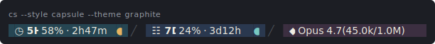
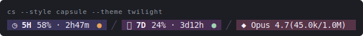
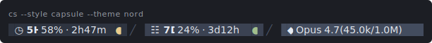
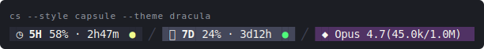
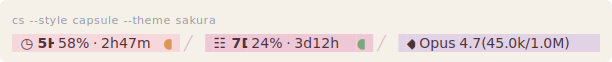
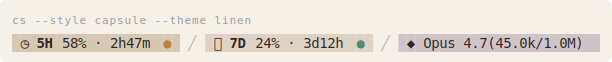
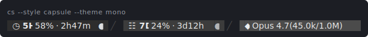

**Hairline** — same theme set, different layout

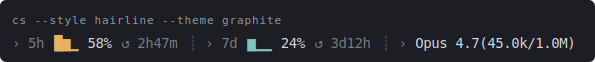
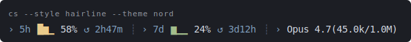
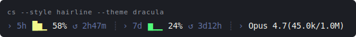
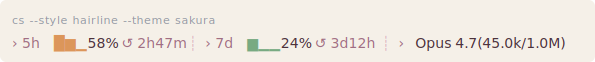
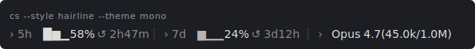

**Classic** — kept identical to the pre-v2.7 look

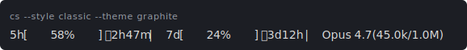

### Themes

| Theme | Vibe |
|-------|------|
| `graphite` | Cool dark graphite — default, fits most dark terminals |
| `twilight` | Soft purples/roses — warm dark |
| `linen`    | Cream/beige — for light terminal themes |
| `nord`     | Nord palette — familiar Arctic blue |
| `dracula`  | Dracula palette — high-contrast purple/black |
| `sakura`   | Pink/cream — soft, light backgrounds |
| `mono`     | Pure grayscale — no chromatic distraction |

Style and theme are independent: any of the **3 styles × 7 themes = 21 combinations**.

### Slash commands inside Claude Code

After running `cs --setup` (or `cs install-commands`), the following slash commands work inside Claude Code:

| Slash command | What it does |
|---------------|--------------|
| `/statusbar`               | Show current config + lists styles/themes |
| `/statusbar-preview`       | Render every style × theme combination using your real data |
| `/statusbar-style <name>`  | Switch style (`classic` / `capsule` / `hairline`) |
| `/statusbar-theme <name>`  | Switch theme (`graphite` / `twilight` / `linen`) |
| `/statusbar-reset`         | Restore the original `classic` + `graphite` defaults |

### Configuration file

Persisted to `~/.claude/claude-statusbar.json`:

```json
{
  "style": "capsule",
  "theme": "twilight",
  "density": "regular",
  "auto_compact_width": 100,
  "show_pet": true,
  "show_weekly": true,
  "show_language": true
}
```

| Key | Values | What it does |
|-----|--------|--------------|
| `style` | `classic` / `capsule` / `hairline` | Layout |
| `theme` | `graphite` / `twilight` / `linen` | Colors |
| `density` | `compact` / `regular` / `cozy` | Padding around segments (capsule + hairline only) |
| `auto_compact_width` | integer (e.g. `100`) | Force `hairline` when terminal narrower than this. `0` = disabled |
| `show_pet`, `show_weekly`, `show_language` | bool | Hide individual segments |

Set via `cs config set <key> <value>`.

Override per-invocation via `--style` / `--theme` flags or `CLAUDE_STATUSBAR_STYLE` / `CLAUDE_STATUSBAR_THEME` env vars.

### Install as a Claude Code plugin

The repo also ships a `.claude-plugin/plugin.json` so you can install everything (slash commands + this README) directly from inside Claude Code:

```
/plugin install https://github.com/leeguooooo/claude-code-usage-bar
```

You still need the `cs` CLI (`pip install claude-statusbar` or `uv tool install claude-statusbar`) — the plugin only carries the slash commands; the heavy lifting is the Python package.

## Install

### One-line install (recommended)

```bash
curl -fsSL "https://raw.githubusercontent.com/leeguooooo/claude-code-usage-bar/main/web-install.sh?v=$(date +%s)" | bash
```

This installs the package, configures Claude Code statusLine, and sets up aliases. Restart Claude Code to see it.

### Package managers

```bash
pip install claude-statusbar     # pip
uv tool install claude-statusbar # uv
pipx install claude-statusbar    # pipx
```

Then add to `~/.claude/settings.json`:

```json
{
  "statusLine": {
    "type": "command",
    "command": "cs"
  }
}
```

## Usage

```bash
cs                            # show status bar (shortest alias)
cs --style capsule            # render with capsule style for one run
cs --theme twilight           # override theme
cs config show                # show persistent config
cs config set style hairline  # save style to ~/.claude/claude-statusbar.json
cs config set theme linen     # save theme
cs styles                     # list available styles
cs themes                     # list available themes
cs preview                    # render every style × theme using your real data
cs --json-output              # machine-readable JSON
cs --no-color                 # disable ANSI colors
cs --hide-pet                 # hide the ASCII pet
cs --warning-threshold 40 --critical-threshold 85
cs --no-auto-update           # disable auto-update checks
```

`--plan` still exists for older scripts, but it is deprecated and no longer changes the status line output.

### Environment variables

| Variable | Effect |
|----------|--------|
| `CLAUDE_STATUSBAR_STYLE=capsule` | Render with this style (overrides config file) |
| `CLAUDE_STATUSBAR_THEME=twilight` | Render with this theme (overrides config file) |
| `CLAUDE_STATUSBAR_NO_UPDATE=1` | Disable automatic update checks |
| `CLAUDE_STATUSBAR_HIDE_PET=1` | Hide the status bar pet |
| `CLAUDE_STATUSBAR_WARNING_THRESHOLD=40` | Switch from green to yellow at 40% |
| `CLAUDE_STATUSBAR_CRITICAL_THRESHOLD=85` | Switch from yellow to red at 85% |
| `NO_COLOR=1` | Disable ANSI colors |

`CLAUDE_PLAN` is still accepted for legacy compatibility, but it no longer changes the rendered status line.

### JSON output

Use `--json-output` if you want a machine-readable payload instead of the formatted status line:

```bash
cs --json-output
```

## Data source

Rate-limit data comes directly from **Anthropic's official API headers** exposed to Claude Code status-line commands through stdin.

Context-window usage comes from the same stdin payload that Claude Code sends to custom `statusLine` commands.

Requires Claude Code `v2.1.80+`.

## Upgrading

Auto-updates once per day. To upgrade manually:

```bash
pip install --upgrade claude-statusbar
```

To disable auto-updates: `export CLAUDE_STATUSBAR_NO_UPDATE=1`

## Integrations

### prompt-language-coach

Install the [prompt-language-coach](https://github.com/leeguooooo/prompt-language-coach) Claude Code plugin to get IELTS band progress tracking. After setup, the status bar automatically shows your current writing level and trend:

```
... | Opus 4.6(90k/1M) | 📚 EN:6.0↑ JA:5.0→ | ᓚᘏᗢ
```

- `↑` improved from last session · `↓` dropped · `→` no change
- No configuration needed — the segment appears automatically when `~/.claude/language-progress.json` exists.

---

## License

MIT

## Star History

[](https://star-history.com/#leeguooooo/claude-code-usage-bar&Date)
