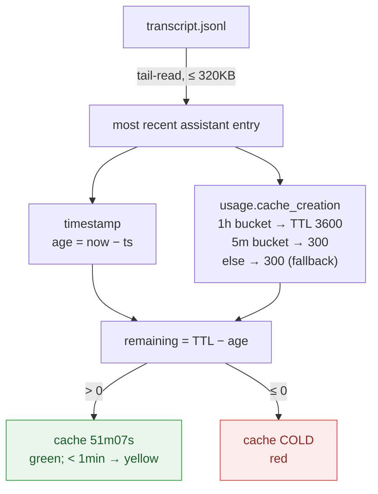

# Data source & how the cache countdown works

## Data source

Rate-limit percentages come directly from **Anthropic's official API headers**, surfaced into the JSON payload Claude Code injects on stdin to every `statusLine` command. Context-window usage comes from the same payload. The enabled-by-default `cache 4m23s` countdown is computed locally by tail-reading the active transcript JSONL, with the TTL (5min vs 1h) auto-detected from Anthropic's per-turn `cache_creation` buckets — see below.

Requires Claude Code `v2.1.80+`.

## How the cache countdown works

The `cache 4m23s` segment is computed locally on every render from the active session transcript. Two design choices keep it accurate:

- **Anchored on the most recent `assistant` entry** — not the last user message, not file mtime. Anthropic's prompt cache is a sliding window (refreshed on every hit), so "time left" is measured from the last turn, and each new turn refills the countdown.
- **TTL is auto-detected** (since v3.9.0), not hard-coded. Anthropic reports, per turn, which TTL it applied in `message.usage.cache_creation`: a non-zero `ephemeral_1h_input_tokens` means a 1-hour cache, `ephemeral_5m_input_tokens` means 5 minutes. That bucket already reflects subscription-vs-API-key auth, `ENABLE_PROMPT_CACHING_1H`, and the over-quota → 5m downgrade, so no static value can match it.

The logic is a couple dozen lines and not Claude-Code-specific — `message.usage.cache_creation` is a standard Claude API field, so you can reuse it in your own status bar or script. See [`activity.py`](../src/claude_statusbar/activity.py) for the implementation: reverse-tail the transcript (≤ 320 KB), anchor the newest `assistant` entry's timestamp for `age`, read the TTL from its `cache_creation` bucket (1h → 3600, 5m → 300), then `remaining = TTL − age` (COLD when ≤ 0).

**Deep dive** — how accurate it really is, plus the Feb→May 2026 cache-TTL saga (1h → 5m → 1h) with sources: [状态栏那行 cache 4m23s，到底准不准？ (Chinese)](https://blog.misonote.com/zh/posts/claude-statusbar-cache-countdown/) · [English version](https://blog.leeguoo.com/en/posts/claude-statusbar-cache-countdown/)
